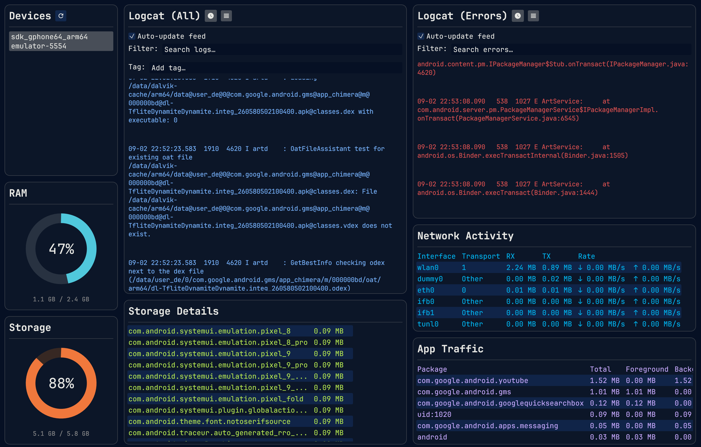

# Android Terminal

A TUI written in Rust for debugging Android devices and emulators on macOS.



Select a device, then watch RAM, storage, logcat, and network in one window. Panels resize by dragging the gaps between them.

Panels:

**Devices** — Connected emulators and USB devices. Click one to drive the rest of the dashboard. The header refresh button re-runs `adb devices`. Offline or unauthorized entries are listed but cannot be selected.

**RAM** — Live memory usage 

**Storage** — Live internal storage

**Logcat (All)** — Streaming logcat for the selected device.

- Substring filter
- Tag filters (type a tag and press Enter)
- Auto-update checkbox to pause the feed
- Header icons toggle timestamps and line spacing
- Lines colored by log level

**Logcat (Errors)** — Logcat but only errors.

**Storage Details** — Category totals and per-app storage.

**Network Activity** — Per-interface RX/TX totals and current down/up rates.

**App Traffic** — Per-package network usage: total, foreground, background, WiFi, and mobile.

## Prerequisites

- **Rust** 1.88+ (see `rust-toolchain.toml`)
- **Android SDK platform-tools** with `adb` on your `PATH`

Install platform-tools via [Android Studio](https://developer.android.com/studio) or the [SDK command-line tools](https://developer.android.com/studio#command-tools), then verify:

```bash
adb version
```

## Run

```bash
cargo run -p android-terminal
```

An Android emulator or USB-connected device must be running and authorized (`adb devices` should list it as `device`).

## Project layout

```
crates/
  adb-client/       # adb command wrappers and parsing
  android-terminal/ # GUI application
```
