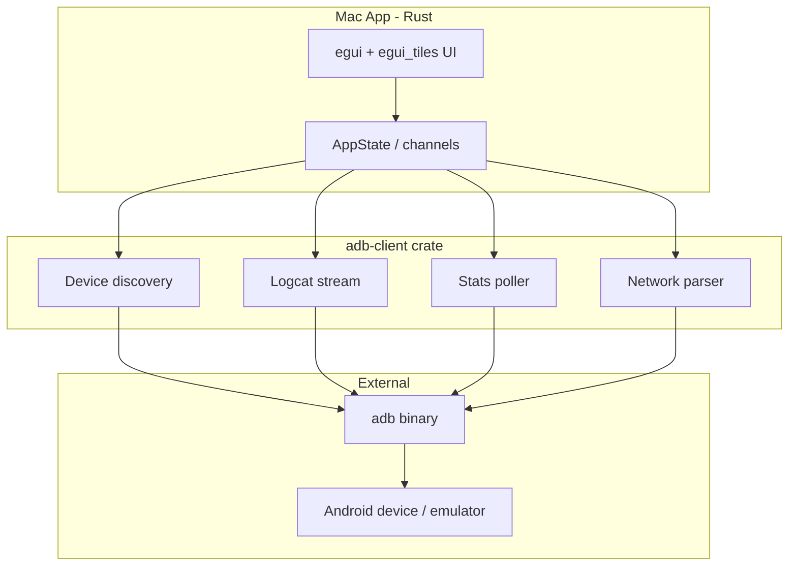
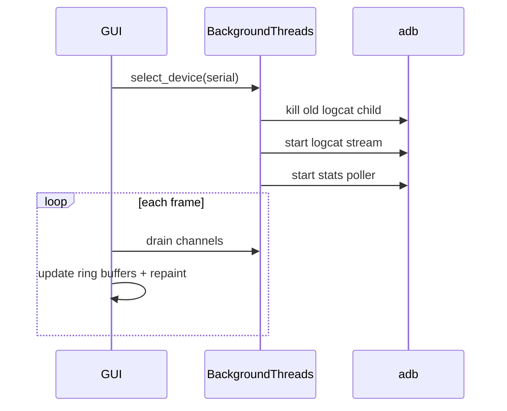

# Android Terminal

## MVP Spec

Implemented in Rust. Should be runnable on Mac

A GUI for debugging android devices including emulator

It will show a large window which consists of smaller windows which can be resized

One window shows errors from the logcat

One window shows all the feed from the logcat

One window shows device memory and disc stats ideally updated regularly eg via polling

At the top show device name

One window shows network activity by protocol

---

# Android Terminal MVP — Implementation Plan

The repo is greenfield (spec only); this plan scaffolds the full MVP from scratch.

## Architecture Overview



**Recommended stack:**
- **GUI:** `eframe` + `egui` + `egui_tiles` — native macOS window, resizable/draggable panel layout
- **ADB:** subprocess calls to system `adb` (no JNI/NDK; app runs on Mac)
- **Concurrency:** background `std::thread` workers + `crossbeam-channel` (or `mpsc`) to feed the UI; egui reads channels each frame
- **Project layout:** Cargo workspace with two crates for separation of concerns

```
android-terminal/
├── Cargo.toml              # workspace
├── crates/
│   ├── adb-client/         # adb commands, parsing, streaming
│   └── android-terminal/   # GUI binary
├── dev-docs/plan1.md
└── README.md
```

---

## Phase 1: Project Foundation

### Step 1.1 — Initialize Cargo workspace
- Create root `Cargo.toml` with workspace members `crates/adb-client` and `crates/android-terminal`
- Add `android-terminal` binary crate depending on `adb-client`
- Pin dependencies: `eframe`, `egui`, `egui_tiles`, `crossbeam-channel`, `anyhow`, `thiserror`, `regex`

### Step 1.2 — Add README and prerequisites
- Document prerequisites: Rust toolchain, Android SDK platform-tools (`adb` on `PATH`)
- Document run command: `cargo run -p android-terminal`
- Note: emulator or USB device must be connected and authorized

### Step 1.3 — Verify `adb` availability at startup
- In `adb-client`, add `Adb::check_available()` — runs `adb version`, returns clear error if missing
- Show error dialog in GUI if `adb` is not found

---

## Phase 2: ADB Client Layer (`crates/adb-client`)

### Step 2.1 — Device discovery
- `adb devices -l` → parse serial, state, model/product info
- `DeviceInfo` struct: `serial`, `model`, `state` (device/offline/unauthorized)
- `adb -s <serial> shell getprop ro.product.model` as fallback for display name

### Step 2.2 — Logcat streaming
- Spawn `adb -s <serial> logcat -v threadtime` as child process
- Read stdout line-by-line in a background thread
- Parse logcat format: `MM-DD HH:MM:SS.mmm  PID  TID LEVEL TAG: message`
- Emit `LogEntry { timestamp, pid, level, tag, message }` via channel
- Support cancellation: kill child process on device switch or app exit

### Step 2.3 — Error log filtering
- Reuse the same logcat stream; filter entries where `level` is `E` (Error) or `F` (Fatal)
- Optionally also include `W` (Warning) behind a toggle later; MVP = E + F only

### Step 2.4 — Memory and disk polling
- Background poller thread (interval: **2 seconds** for MVP)
- Memory: `adb shell cat /proc/meminfo` → parse `MemTotal`, `MemFree`, `MemAvailable`, `Buffers`, `Cached`
- Disk: `adb shell df -h` → parse filesystem, size, used, available, use%
- Emit `SystemStats { memory, disks, timestamp }` via channel

### Step 2.5 — Network activity
**Note:** Android `adb` does not expose true per-protocol (TCP/UDP/HTTP) stats without root. MVP interpretation:

| MVP (achievable) | Enhancement (later) |
|---|---|
| Per-transport: WiFi vs Mobile (from `dumpsys netstats detail`) | TCP vs UDP connection counts via `adb shell ss -H -t` / `ss -H -u` |
| Per-interface rx/tx bytes from `/proc/net/dev` | Per-UID breakdown from netstats UID section |

- Poll every **2 seconds** alongside system stats
- Parse `dumpsys netstats detail` for Dev/Xt statistics (rxBytes, txBytes per interface)
- Compute delta bytes/sec between polls for a live throughput display
- Present as table: Interface / Transport / RX / TX / Rate

---

## Phase 3: GUI Shell (`crates/android-terminal`)

### Step 3.1 — Window and app state
- `eframe::run_native` with large default window (e.g. 1400×900)
- `App` struct holds:
  - Selected `DeviceInfo`
  - Channel receivers for logcat, errors, stats, network
  - Ring buffers for log lines (cap at ~10,000 lines to bound memory)
  - `egui_tiles::Tree<PanelId>` for layout

### Step 3.2 — Top bar: device name and selector
- Fixed header above the tile tree (not inside a resizable panel)
- Show `"{model} ({serial})"` for selected device
- Dropdown to switch devices; on switch: stop old streams, start new ones
- Refresh device list button (re-run `adb devices`)

### Step 3.3 — Resizable panel layout with `egui_tiles`
- Define `enum PanelId { LogcatAll, LogcatErrors, SystemStats, Network }`
- Implement `egui_tiles::Behavior` trait:
  - `pane_ui` renders each panel's content
  - `tab_title_for_pane` returns human-readable names
- Default layout (horizontal split, then vertical):

```
┌─────────────────────────────────────────────────────┐
│  Device: Pixel 7 (emulator-5554)          [▼] [↻]  │
├──────────────────────┬──────────────────────────────┤
│  Logcat (All)        │  Logcat (Errors)             │
│                      │                              │
├──────────────────────┼──────────────────────────────┤
│  Memory / Disk       │  Network Activity            │
│                      │                              │
└──────────────────────┴──────────────────────────────┘
```

- Users can drag, resize, and tab panels via `egui_tiles` defaults

### Step 3.4 — Panel implementations

**Logcat (All):** `egui::ScrollArea` with monospace font; auto-scroll to bottom when pinned; show last N lines; optional text filter input

**Logcat (Errors):** Same as above, pre-filtered to E/F; highlight error lines in red

**Memory / Disk:**
- Memory: progress bars for used vs total; label values in MB/GB
- Disk: table of mount points with used/available bars

**Network:**
- Table: interface name, transport type, cumulative rx/tx, current rate (B/s or KB/s)
- Show "polling…" state when no data yet

---

## Phase 4: Wiring and Lifecycle

### Step 4.1 — Connect streams on device selection


- On device select: spawn logcat thread + stats poller thread
- On device deselect / app close: send shutdown signal, join threads, kill adb child

### Step 4.2 — Error handling
- Show inline panel errors (e.g. "device offline", "logcat permission denied")
- Retry poller on transient adb failures (back off to 5s)
- Log adb stderr to the errors panel when commands fail

---

## Phase 5: Polish and Validation

### Step 5.1 — Manual test checklist
- [ ] App launches on macOS with no device → shows "no devices" state
- [ ] Android emulator detected and selectable
- [ ] Physical device via USB detected
- [ ] Logcat all panel streams live output (`adb logcat` equivalent)
- [ ] Errors panel shows only E/F lines
- [ ] Memory/disk updates every ~2s
- [ ] Network panel shows interface stats with changing rates
- [ ] Panels are resizable and draggable
- [ ] Device name shown in header
- [ ] Switching devices cleanly restarts streams

### Step 5.2 — `.gitignore`
- Standard Rust ignores: `target/`, `.DS_Store`

---

## Key Files to Create

| File | Purpose |
|---|---|
| `Cargo.toml` | Workspace root |
| `crates/adb-client/Cargo.toml` | ADB library deps |
| `crates/adb-client/src/lib.rs` | Public API |
| `crates/adb-client/src/device.rs` | Device discovery |
| `crates/adb-client/src/logcat.rs` | Logcat stream + parser |
| `crates/adb-client/src/stats.rs` | Memory/disk polling |
| `crates/adb-client/src/network.rs` | Network stats parsing |
| `crates/android-terminal/src/main.rs` | Entry point |
| `crates/android-terminal/src/app.rs` | App state + eframe setup |
| `crates/android-terminal/src/panels.rs` | Panel renderers |
| `crates/android-terminal/src/tiles.rs` | egui_tiles Behavior |
| `README.md` | Build/run docs |

---

## Risks and Mitigations

| Risk | Mitigation |
|---|---|
| `adb` not on PATH | Startup check with install instructions |
| Logcat format varies by Android version | Use `-v threadtime`; parser tolerant of minor variations |
| "Network by protocol" not available via adb | MVP shows transport/interface breakdown; document limitation |
| High logcat volume freezes UI | Ring buffer cap; drain channel with max lines per frame |
| Multiple devices | Device picker in header; one active stream set at a time |

---

## Suggested Implementation Order

Work in this sequence so each step is runnable and testable:

1. Workspace + empty window (Step 1)
2. Device discovery + header bar (Steps 2.1, 3.2)
3. Logcat all panel (Steps 2.2, 3.4 partial)
4. Logcat errors panel (Step 2.3)
5. Resizable tile layout (Step 3.3)
6. Memory/disk panel (Steps 2.4, 3.4)
7. Network panel (Steps 2.5, 3.4)
8. Lifecycle polish + README (Phases 4–5)

---

## Implementation Todos

- [ ] Initialize Cargo workspace with adb-client and android-terminal crates, deps, .gitignore, README
- [ ] Implement adb-client device discovery (adb devices -l, getprop) with availability check
- [ ] Implement logcat subprocess streaming, line parser, and E/F error filter
- [ ] Implement memory (/proc/meminfo) and disk (df) polling with 2s interval
- [ ] Implement network stats from dumpsys netstats + /proc/net/dev with rate calculation
- [ ] Build eframe app with device header bar, channel-based AppState, ring buffers
- [ ] Set up egui_tiles with 4 resizable panels and default 2x2 layout
- [ ] Implement all four panel UIs (logcat all, errors, memory/disk, network)
- [ ] Wire device selection to start/stop streams; handle errors and shutdown
- [ ] Test against emulator and physical device; verify all MVP checklist items
